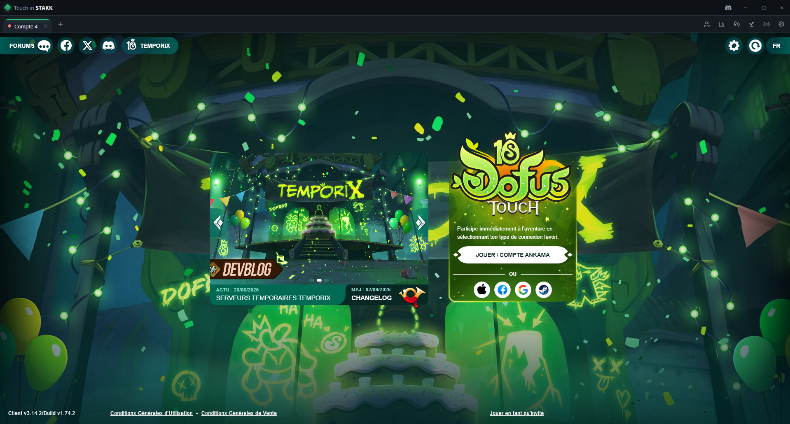
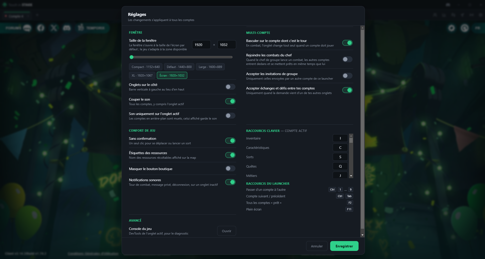

# Dofus Touch | Touch in STAKK

[Français](README.md) · **English**

Desktop launcher for **Dofus Touch** (macOS / Windows), built for multi-account
play. It loads the official game client in one window per account, presents
itself to the servers as an Android tablet, and adds the tools PC players are
missing on top: party-leader follow, automatic fight joining, auto-harvest,
auto-travel on the world map, keyboard shortcuts and key broadcasting.

This launcher builds on the work of other launchers, open source or not,
stripped of the "malicious" code they carried — harvesting the user's personal
information, capturing the desktop, and so on.



> Not affiliated with Ankama Games. Presenting itself as the Android client may
> breach the Dofus Touch terms of service — use at your own risk, with your own
> credentials only.

## Installation

Download the latest build from [Releases](../../releases):

| Platform | File |
|---|---|
| macOS Apple Silicon | `Touch-in-STAKK-<version>-arm64.dmg` |
| macOS Intel | `Touch-in-STAKK-<version>-x64.dmg` |
| Windows (installer) | `Touch-in-STAKK-Setup-<version>.exe` |
| Windows (portable) | `Touch-in-STAKK-portable-<version>.exe` |

### macOS: one-command install

The builds are not signed by Apple, so Gatekeeper blocks the downloaded `.dmg`
("malicious software"). This script downloads the latest version, installs it
into /Applications and lifts the block:

```
curl -fsSL https://raw.githubusercontent.com/vDAKK/touch-in-stakk/master/install.sh | sh
```

By hand it amounts to: copy the app into /Applications, then
`xattr -dr com.apple.quarantine "/Applications/Touch in STAKK.app"`.

On Windows, SmartScreen asks for a confirmation ("More info → Run anyway").

### Updates

On Windows the app updates itself (it watches the releases, downloads, and
offers to install). On macOS, installing an update automatically requires a
signed application — run the script above again to move to the next version.

## Features

### Multi-account
- **One tab per account**, each with its own persistent session (cookies,
  remembered login) and its own device identity.
- **Ctrl+1…9** to switch accounts, **Ctrl+Tab** to cycle.
- **Automatic switch** to whichever account has to play in combat.
- **Party up**: invites every account of the launcher into the active account's
  party; invitations between your own accounts are accepted automatically.
- **Follow the leader**: the other accounts join the party leader — neighbouring
  cell on the same map, a map hop, or a full trip otherwise. Never touches the
  leader itself, nor accounts in combat.
- **Join the leader's fights** (setting): when the party leader starts a fight,
  the mules join it and ready up at the same time.
- **Key broadcasting**: the active account's shortcuts are replayed on all the
  others.
- **F2**: ready up every account.
- Global sound, or **on the active tab only**.

### Auto-travel
- On the world map, click (or right-click) an area → **"Run here"** in the
  game's own menu. The character travels to those coordinates.
- Route computed with **A\*** over the world map, learning impassable borders
  and re-planning along the way.
- Any manual action (moving, clicking a resource) **interrupts** the trip in
  progress, with a notification inside the game.

### Auto-harvest
- **Harvest** button in the toolbar: gathers every resource the character can
  work on this map (profession level and tool are the game's own call), nearest
  first.
- Optional: a **circuit** of coordinates to loop through
  (`stakkHarvest([{x:5,y:-18},{x:5,y:-17}])` from the launcher console).
- Pauses automatically in combat and resumes after. Variable delays between
  actions.
- Stops as soon as you play by hand.

### Comfort
- No more move and spell confirmations (a single click).
- Configurable keyboard shortcuts for the game's own windows (inventory, spells,
  map, quests, professions…) and for "show entities".
- Physical keyboard input in the game's number pads, Enter to confirm popups.
- Resource labels on the map, shop button hidden.
- Notifications (combat turn, private message, invitation, disconnection) on
  background tabs.
- Background tabs **keep running at full speed**: neither Chromium nor the
  client slows them down.

### Language
The interface comes in **French or English**, including the messages drawn
inside the game ("Run here", travel and harvest notifications). By default the
launcher follows the system language — French on a French machine, English
everywhere else — and the choice can be forced in the settings, applied
immediately with no restart. The Dofus client's own language stays the one on
your Ankama account.

### Device identity
Each account presents itself as **a different, stable Android tablet** (HTTP
User-Agent, `navigator`, screen, touch, memory, cores — all consistent with one
another). An account keeps the same device from one launch to the next.

## Settings

Gear button in the toolbar. Language, window size (slider, presets, fit to
screen, live preview), sound, multi-account, comfort, shortcuts. Saved in
`userData/settings.json`. Logs in `userData/logs/app.log`.



## Launcher console (advanced)

`Cmd/Ctrl+Alt+I` on the launcher opens its console. A few commands acting on the
active account:

```js
stakkTravel(null, 5, -18)                      // travel to those coordinates
stakkTravelCancel()
stakkHarvest()                                 // harvest the current map
stakkHarvest([{x:5,y:-18},{x:5,y:-17}])        // circuit, on a loop
stakkHarvestStop() / stakkHarvestStatus()
stakkEval("navigator.userAgent")               // run code inside the game
```

## Development

```
npm install
npm start          # from a VS Code terminal: env -u ELECTRON_RUN_AS_NODE npm start
npm test
npm run dist:mac   # .dmg + .zip (arm64 + x64)
npm run dist       # NSIS installer + Windows portable
```

How it works: a local Express server proxies the client's files from the Ankama
CDN and applies the community compatibility patches to them (`regex.json` from
`zenoxs/lindo-game-base`). Each account runs in an Electron `<webview>` with a
preload that injects a hook into the game (the `window.gui` event bus, the
`isoEngine` engine) — that is the path the follow, harvest, travel and shortcut
features take.

| File | Role |
|---|---|
| `src/main/index.js` | Lifecycle, window, proxy, IPC, updates |
| `src/main/proxy.js` | CDN proxy + patch application |
| `src/main/patcher.js` | Fetching and applying the regex rules |
| `src/main/spoof.js` | Per-account device profiles (UA, screen…) |
| `src/main/session-prep.js` | Preparing an account session |
| `src/main/settings.js` / `accounts.js` | Persistence |
| `src/preload/game.js` | Hook injected into the game: follow, combat, harvest, travel, shortcuts |
| `src/preload/index.js` | `window.touch` IPC bridge |
| `src/renderer/` | Launcher interface (tabs, toolbar, settings) |
| `src/i18n/strings.js` | FR/EN dictionaries, shared by main, the preloads and the renderer |

## Translating

Every string lives in `src/i18n/strings.js`, one dictionary per language. The
markup carries no hard-coded text: each element has a `data-i18n` (or
`data-i18n-title` / `data-i18n-aria`) filled at load time and on every language
change. `npm test` fails if a key is missing on either side, or if translatable
text is hard-coded in the HTML.

## Publishing a version

The GitHub Actions workflow builds macOS and Windows on every push to `master`
(artifacts) and **publishes a release** when a `vX.Y.Z` tag is pushed:

```
npm version minor        # or patch / major — updates package.json and creates the tag
git push && git push --tags
```

The update files (`latest.yml`, `latest-mac.yml`) are attached to the release;
the auto-updater of existing installations picks them up.
